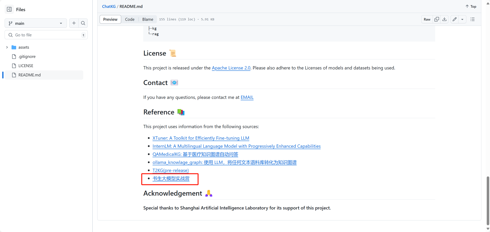

<div style="; border-bottom: 4px solid black; width: 100%; box-sizing: border-box; text-align: center; padding-top: 0.1rem; color: rgb(99,108,118)" align="center">
    <h1>书生大模型实战营「第3期」学员笔记<br/><span style="font-style: italic">入门岛 - Git 基础知识</span></h1>
</div>
<div style="text-align: center;" align="center">
    笔记记录人：ZK-Jackie&nbsp;&nbsp;&nbsp;&nbsp;&nbsp;&nbsp;笔记记录时间：2024.7.12
</div>

## 目录

- 前言
  1. Git
  2. Git 特点与前景
- 闯关任务
  1. 破冰活动：自我介绍
  2. 实践项目：构建个人项目
- 总结
- 参考资料

## 前言

### 1. Git

Git 是一个分布式版本控制系统，由 Linus Torvalds 于 2005 年创建。Git 的设计目标是速度、数据完整性和支持非线性分布式工作流。Git 是一个自由开源软件，最初是为更好地管理 Linux 内核开发而设计的。

Git 与集中式版本控制系统（如 SVN）不同，每个开发者都可以拥有自己的本地仓库，可以在本地进行版本控制，不需要联网。Git 通过分支管理，可以方便地进行代码的合并和管理，支持多人协作开发，可以有效地避免代码冲突。

### 2. Git特点与前景

Git 是一个分布式版本控制系统，具有以下特点：

1. 分布式：每个开发者都可以拥有自己的本地仓库，可以在本地进行版本控制，不需要联网。
2. 高效：Git 通过分支管理，可以方便地进行代码的合并和管理，支持多人协作开发，可以有效地避免代码冲突。
3. 数据完整性：Git 采用 SHA-1 算法计算数据的校验和，保证数据的完整性。
4. 支持非线性分布式工作流：Git 支持多种工作流模型，可以根据团队的需求选择合适的工作流模型。
5. 开源：Git 是一个自由开源软件，任何人都可以免费使用和修改。
6. 社区活跃：Git 的社区非常活跃，有大量的开发者和用户，提供了丰富的插件和工具。
7. 跨平台：Git 可以在 Windows、Linux 和 Mac OS 等多种操作系统上运行，具有很好的移植性。
8. 安全性：Git 采用 SSH 协议进行通信，数据传输安全可靠。
9. 易用性：Git 提供了丰富的命令和选项，可以方便地进行版本控制和管理。

Git 在软件开发、数据科学、人工智能、科学计算等领域得到了广泛应用，是目前最流行的版本控制系统之一。Git 的发展前景非常广阔，随着开源社区的不断壮大和技术的不断发展，Git 将会在更多的领域得到应用，成为开发者不可或缺的工具。

## 闯关任务

### 1. 破冰活动：自我介绍

> - 任务描述：每位参与者提交一份自我介绍。
> - 提交地址：https://github.com/InternLM/Tutorial 的 camp3 分支
> - 实现步骤：
>   1. 将该仓库的 camp3 分支 fork 到自己的 GitHub 仓库
>   2. 在 `./data/Git/task/` 目录下创建一个名为 `camp3_<id>.md` 的文件，其中 `<id>` 是您的报名问卷ID
>   3. 在文件中填写自我介绍内容
>   4. 提交 Pull Request，将自我介绍文件请求添加到 camp3 分支

首先，打开指定的[仓库链接地址](https://github.com/InternLM/Tutorial)，点击右上方的 `fork`，即可将该仓库分叉到自己的 GitHub 仓库中，则可在自己的 GitHub 仓库列表中看到 `camp3` 分支的仓库，如`图 1`所示。（注意执行 fork 操作时，取消勾选“Copy the camp1 branch only”选项）

<div class="image-box" style="text-align: center;" align="center">
    
    <br/>
    <div class="caption" style="border-bottom: 1px solid #d9d9d9;
    display: inline-block;
    color: #999;
    padding: 2px;">图 1 fork</div>
</div>

在自己的 GitHub 仓库中，找到 `camp3` 仓库，点击进入，然后在 `./data/Git/task/` 目录下创建一个名为 `camp3_<id>.md` 的文件。在文件中填写自我介绍内容并保存，如`图 2`所示。

<div class="image-box" style="text-align: center;" align="center">
    
    <br/>
    <div class="caption" style="border-bottom: 1px solid #d9d9d9;
    display: inline-block;
    color: #999;
    padding: 2px;">图 2 create</div>
</div>

保存后，在当前仓库点击 `Pull Request` 选项，然后点击右侧 `New pull request` 按钮，选择好远仓库与更该仓库相同的分支，页面即显示两分支的不同之处与个人修改过的相关信息，可将自我介绍文件请求添加到 `camp3` 分支，如`图 3`所示。

<div class="image-box" style="text-align: center;" align="center">
    
    <br/>
    <div class="caption" style="border-bottom: 1px solid #d9d9d9;
    display: inline-block;
    color: #999;
    padding: 2px;">图 3 pull</div>
</div>

在页面中填写好相关信息，然后保存提交 Pull Request，将自我介绍文件请求添加到 camp3 分支，随后便能够在原仓库的 `Pull requests` 中看到自己的提交请求，如`图 4`所示。

<div class="image-box" style="text-align: center;" align="center">
    
    <br/>
    <div class="caption" style="border-bottom: 1px solid #d9d9d9;
    display: inline-block;
    color: #999;
    padding: 2px;">图 4 pull request</div>
</div>

本次任务完成。

---

### 2. 实践项目：构建个人项目

> - 任务描述：创建一个个人仓库，用于提交笔记、心得体会或分享项目。
> - 实现步骤：
>  1. 在 GitHub 中创建一个公开仓库
>  2. 创建仓库介绍文件，并添加超链接跳转至 [书生大模型实战营教程仓库](https://github.com/InternLM/Tutorial)

首先，打开 GitHub 主页，点击左侧的 `New` 按钮，进入到 `Create a new repository` 仓库创建页面。在该页面中填写相关信息后，在本地指定目录下打开终端，输入以下指令，将仓库克隆至本地：

```bash
git clone https://github.com/<username>/<repository>.git
```

其中，`<username>` 为自己的 GitHub 用户名，`<repository>` 为创建的仓库名称。克隆完成后，本地进入到该仓库目录，创建一个 `README.md` 文件，填写仓库介绍内容，并添加超链接跳转超链接。最后，再将该文件提交到个人的仓库中，如所示。

```bash
git add README.md &&
git commit -m "Update README.md" &&
git push origin master
```

提交完成后，再次打开 GitHub 主页，进入该仓库，便能够在仓库下方看到带有超链接的仓库介绍内容，如所示。



本次任务完成。

---

## 总结

本次任务主要是完成了两个 Git 课程任务，分别是破冰活动：自我介绍和实践项目：构建个人项目。通过这两个任务，我学会了如何在 GitHub 上提交自我介绍和创建个人仓库，这对我今后的学习和工作都有很大的帮助。Git 是一个非常强大的版本控制系统，可以帮助我们更好地管理代码，提高团队协作效率，是每个开发者都应该掌握的工具。

## 参考资料

- [Git 官方文档](https://git-scm.com/doc)
- [GitHub 官方文档](https://docs.github.com/cn)
- [书生大模型实战营「第3期」学员闯关手册 - 飞书云文档](https://aicarrier.feishu.cn/wiki/XBO6wpQcSibO1okrChhcBkQjnsf)
- [书生大模型实战营「第3期」第3关 Git 基础知识任务](https://github.com/InternLM/Tutorial/blob/camp3/docs/L0/Git/task.md)
